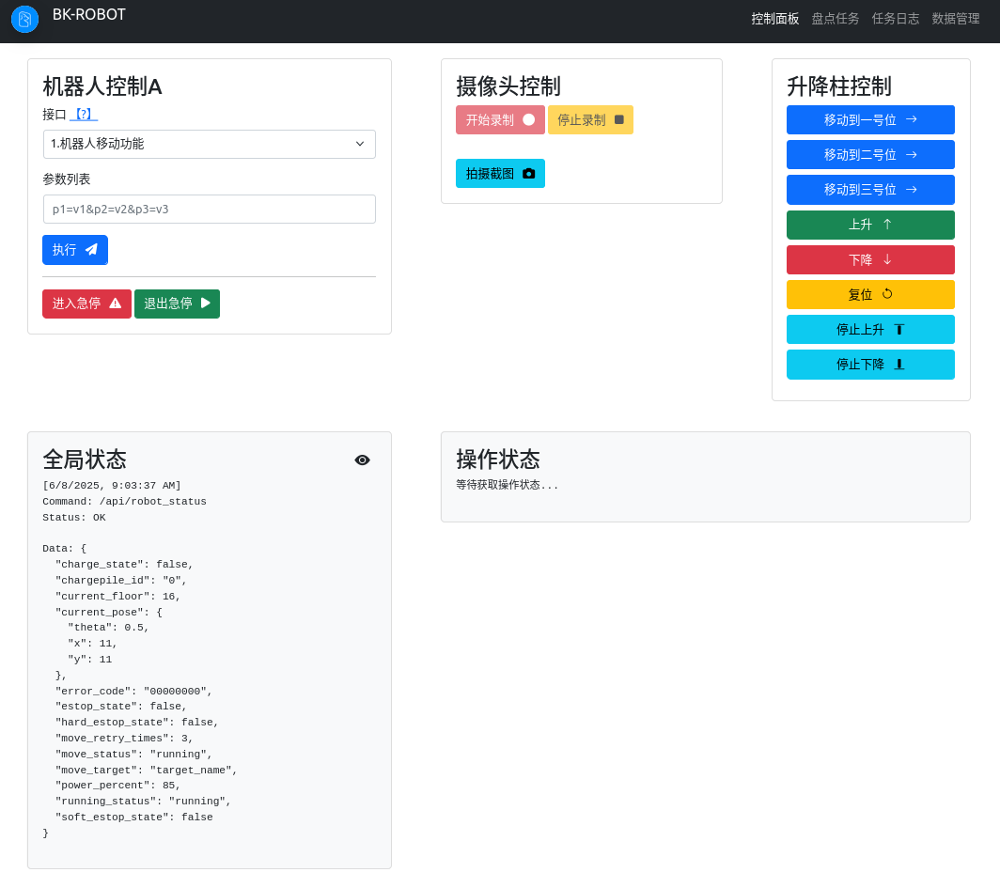
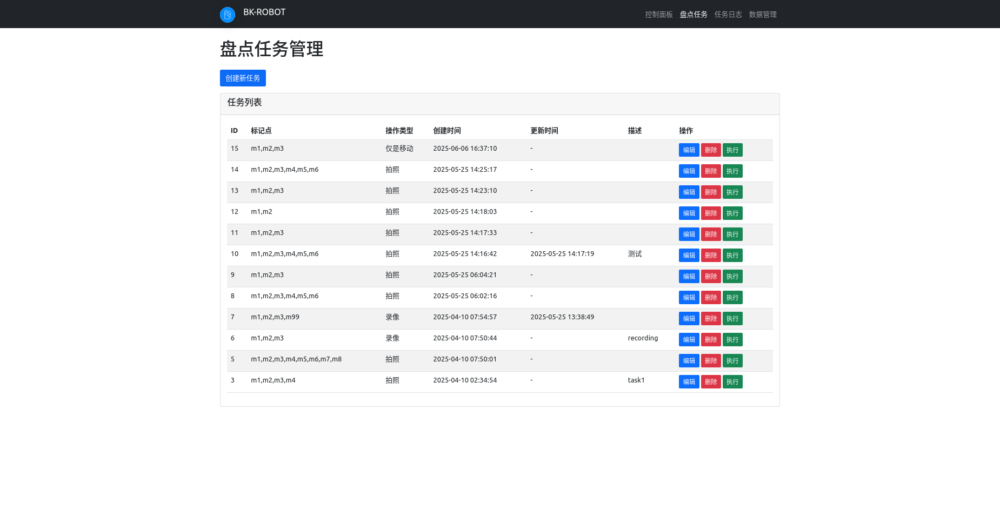
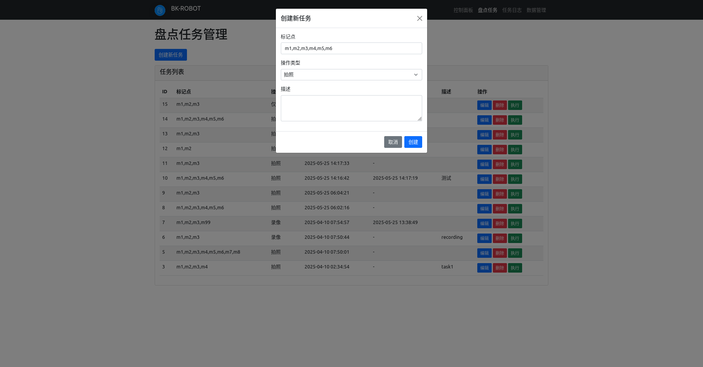
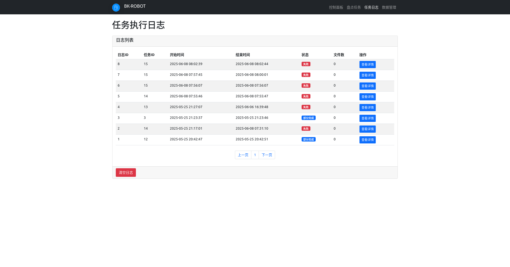
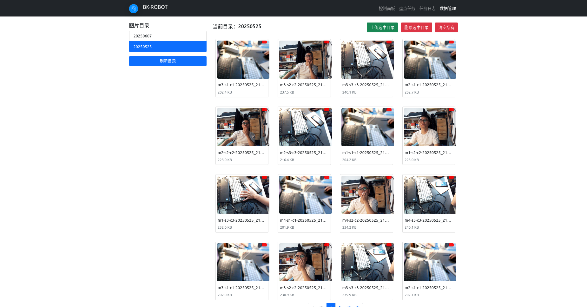

## 目标
- 实现图书馆机器人自动智能视觉图书盘点
- 智能视觉图书盘点机器人有以下及部分组成
    - 硬件
        - 机器人底座
        - 工控机
        - 显示屏幕（触摸可选）
        - 运动摄像头模组(6个)
        - 摄像头支架
    - 软件
        - 采用国产银河麒麟或者OpenKylin系统
        - OBS 提供摄像头控制接口
        - 自研的软件按照一定的逻辑控制机器人底座和摄像头的行为
        - 对书架图书进行拍照和录制视频, 照片和视频按一定规则命名和保存

- 应用需求（用户视角）
    - 通过机器人屏幕提供的GUI下达盘点等指令
    - 机器人语音指令（可选）
- 开发需求（研发视角）
    - 统一的接口系统 （Flask API）
	- 对接机器人底座接口，控制机器人的运动
	- 对接OBS 接口，控制摄像头模组完成拍摄行为
	- 盘点任务逻辑算法接口，实现同时控制底座和摄像头
	- 盘点任务的后台管理
    - 为GUI提供适当的接口
    - GUI 


## 技术栈
- Python 
- Flask API
- 
- [机器人底座控制接口](http://waterdocs.pages.yunjichina.com.cn/user_manual/exports/water_api.html#water%E6%B0%B4%E6%BB%B4%E8%BD%AF%E4%BB%B6api%E6%89%8B%E5%86%8C)
- OBS 提供websocket 接口来控制多个摄像头拍照


### 系统框图


### Screenshot








### DEV Notes
- pip install xxxx -i https://repo.huaweicloud.com/repository/pypi/simple/
- use current venv, see requirements.txt for detail python packages 


- shot with position_info
```
curl -X POST http://localhost:5000/api/obs/screenshot \
  -H "Content-Type: application/json" \
  -d '{"position_info": "Marker1"}'
{
  "position": "Marker1",
  "results": [
    {
      "camera_id": 1,
      "filename": "Marker1-s1-s1-20250525_112856.jpg",
      "filepath": "static/screenshots/20250525/Marker1-s1-c1-20250525_112856.jpg",
      "scene": "s1",
      "status": "OK"
    },
    {
      "camera_id": 2,
      "filename": "Marker1-s2-s2-20250525_112856.jpg",
      "filepath": "static/screenshots/20250525/Marker1-s2-c2-20250525_112856.jpg",
      "scene": "s2",
      "status": "OK"
    },
    {
      "camera_id": 3,
      "filename": "Marker1-s3-s3-20250525_112856.jpg",
      "filepath": "static/screenshots/20250525/Marker1-s3-c3-20250525_112856.jpg",
      "scene": "s3",
      "status": "OK"
    }
  ],
  "status": "OK",
  "timestamp": "20250525_112856"
}
```

- shot without position_info


### Run OBS with headless
```bash
obs --minimize-to-tray
```