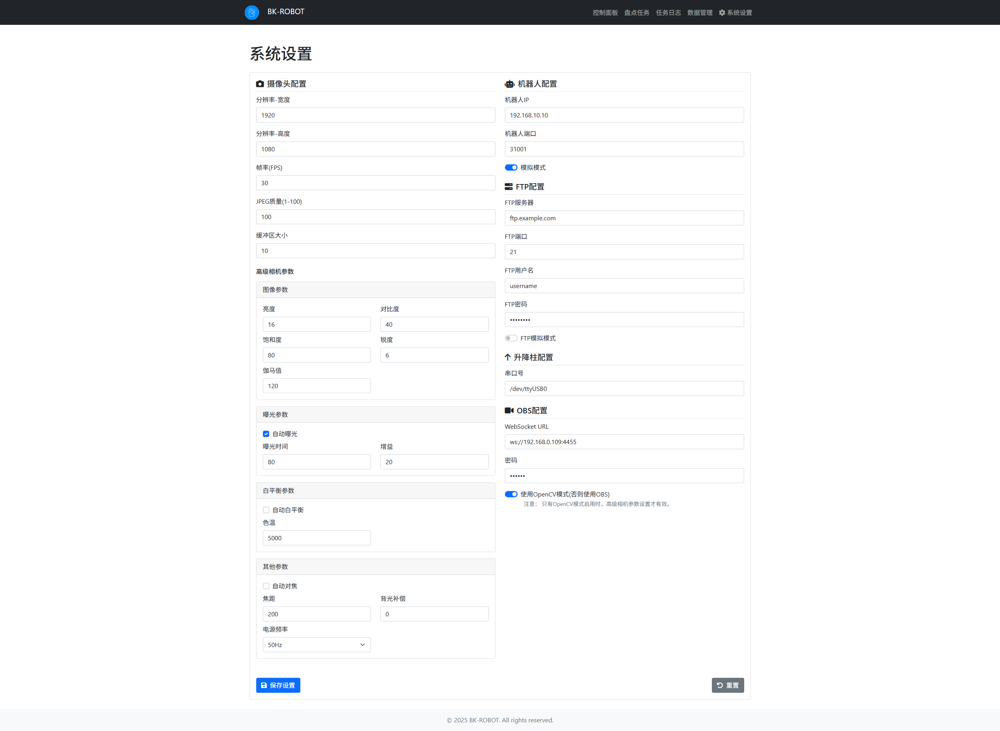

## 目标
- 实现图书馆机器人自动智能视觉图书盘点
- 智能视觉图书盘点机器人由以下及部分组成
    - 硬件
        - 机器人底座 [控制接口](./docs/WATER_API.pdf)
        - 工控机  
        - 显示屏幕*
        - 摄像头模组
        - 升降柱
    - 软件
        - 银河麒麟/OpenKylin系统
        - 控制算法
        - 任务管理
        - 任务日志管理
        - 数据管理
        - 用户认证
        - 系统设置

## 技术栈
- Linux
- Python 
- Flask
- OpenCV/OBS

## 系统框图
*All  in code*

## 界面





## 架构

```

bk-robot/
├── .env                              # 环境变量配置文件
├── .gitignore                        # Git忽略规则
├── LICENSE                           # 许可证
├── README.md                         # 项目说明文件
├── config.py                         # 全局配置
├── install_py_venv.sh                # Python虚拟环境安装脚本
├── obs_start.sh                      # OBS启动脚本
├── requirements.txt                  # Python依赖列表
├── robot_kill.sh                     # 机器人进程终止脚本
├── robot_restart.sh                  # 机器人重启脚本
├── robot_start.sh                    # 机器人启动脚本
├── run.py                            # 项目主入口
├── app/                              # 主应用目录
│   ├── __init__.py                   # 应用初始化
│   ├── camera_control.py             # 摄像头控制逻辑
│   ├── ffmpeg_control.py             # ffmpeg相关控制
│   ├── lift_control.py               # 升降机控制
│   ├── models.py                     # 数据模型
│   ├── obs_control.py                # OBS控制逻辑
│   ├── opencv_control.py             # OpenCV相关控制
│   ├── robot_control.py              # 机器人控制
│   ├── routes.py                     # 路由定义
│   ├── logs/                         # 日志目录
│   ├── static/                       # 静态资源
│   ├── templates/                    # 前端模板
│   └── utils/                        # 工具函数
├── docs/                              # 项目文档
│   ├── BK-ROBOT-API.md               # API文档
│   ├── dev-notes.md                  # 开发笔记
│   └── issues.md                     # 问题记录
├── instance/                          # 运行时实例数据
│   └── tasks.db                      # 任务数据库
├── scripts/                           # 辅助脚本目录
│   ├── cams_info.sh                  # 摄像头信息查询脚本
│   ├── cams_test.py                  # 摄像头测试脚本（Python）
│   ├── robot_power_monitor.py        # 机器人电量监控脚本
│   ├── robot_power_monitor.service   # 机器人电量监控服务
│   ├── check_uvc_cam.sh              # 检查UVC摄像头脚本
│   ├── disable_auto_upgrade.sh       # 禁用系统自动升级脚本
│   ├── hold_current_kernel.sh        # 锁定当前内核版本脚本
│   ├── install_py_venv.bat           # Python虚拟环境安装批处理脚本（Windows）
│   ├── install_v4l.sh                # 安装V4L（视频设备）相关依赖脚本
│   ├── kernel_manager.sh             # 内核管理脚本
│   ├── keyring_manager.sh            # 密钥环管理脚本
│   ├── logs_clean.sh                 # 日志清理脚本
│   └── robot_start.sh                # 机器人系统自启动脚本
└── static/                            # 全局静态资源

```