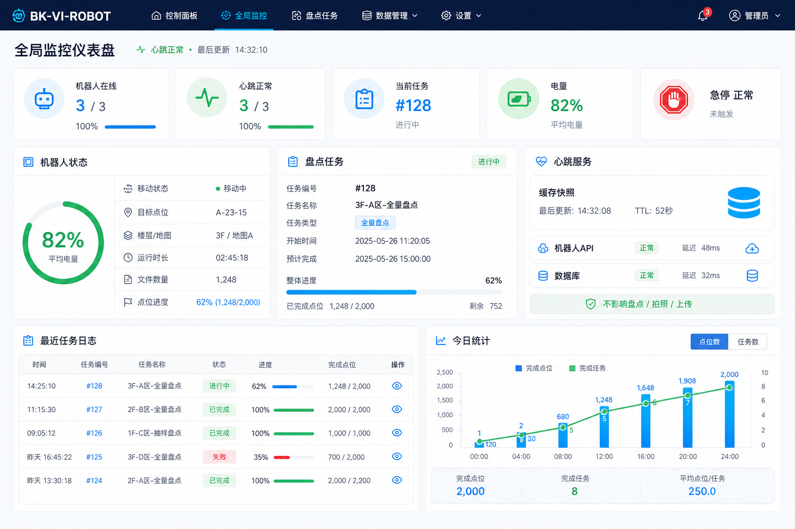

# 全局监控仪表盘设计

## 目标

新增一个只读的全局监控仪表盘页面，用于在机器人上位机自带屏幕上展示机器人、摄像头和盘点任务的整体状态。页面面向管理员和普通用户，优先保证状态清晰、刷新稳定、不会影响盘点、拍照、录像和图片上传。

高保真原型图见：



## 已确认需求

- 使用场景：机器人上位机软件内置页面，在机器人自带屏幕上显示。
- 屏幕分辨率：`1920x1080`。
- 用户权限：管理员和普通用户都可以查看。
- 页面性质：只读监控页，不提供控制按钮。
- 底部全局状态栏：进入仪表盘页面时隐藏，其他页面暂时保留。
- 机器人状态：通过独立心跳任务采集，不由页面直接高频访问机器人 API。
- 任务状态：展示当前盘点任务和进度，进度可按 marker 数量计算。
- 摄像头状态：只显示在线或离线，不自动拉 RTSP 视频流。
- 心跳策略：任务执行中继续低频监控，刷新频率可配置。

## 页面信息架构

页面按一屏展示设计，避免滚动依赖：

1. 顶部导航
   - 保持现有深蓝导航风格。
   - 新增入口：`全局监控`。
   - 当前页面隐藏底部固定全局状态栏，释放屏幕空间。

2. 顶部 KPI 状态条
   - `机器人在线`
   - `心跳正常`
   - `当前任务`
   - `电量`
   - `急停状态`

3. 主体左侧：机器人状态
   - 电量环形仪表。
   - 移动状态：`move_status`。
   - 运行状态：`running_status`。
   - 目标点位：`move_target`。
   - 楼层、建筑、地图 ID。
   - 健康状态：普通错误、严重错误、急停。

4. 主体中间：盘点任务
   - 当前任务 ID。
   - 当前执行日志 ID。
   - 动作类型：拍照或录像。
   - 开始时间和运行时长。
   - 点位总数、已完成点位数、当前点位。
   - 文件数量。
   - 点位进度条。

5. 主体右侧：心跳服务和摄像头状态
   - 心跳是否运行。
   - 缓存是否新鲜。
   - 最近成功采集时间。
   - 最近错误信息。
   - 摄像头列表：在线或离线。
   - 明确标识：`不影响盘点 / 拍照 / 上传`。

6. 底部区域
   - 最近任务日志。
   - 今日任务统计：完成、部分完成、失败、进行中。
   - 可选展示最近文件数量趋势。

## 视觉风格

延续现有界面风格：

- 背景：浅灰或浅蓝灰。
- 导航：深蓝 `#192a56`。
- 主色：亮蓝 `#00a8ff`。
- 成功：绿色 `#2ecc71`。
- 告警：黄色 `#f1c40f`。
- 故障：红色 `#e74c3c`。
- 卡片：白底、轻阴影、圆角不超过 `8px`。
- 信息密度：偏运维监控，避免营销式大标题和大面积装饰。
- 图形元素：环形电量、状态灯、进度条、小型统计图、紧凑表格。

## 后端心跳设计

### 原则

仪表盘页面不得直接高频调用机器人状态接口。后端使用单独心跳任务统一采集状态，并写入内存缓存。页面只读取缓存快照。

这样可以避免多个浏览器页面同时打开时重复访问机器人 API，也可以避免机器人 API 慢响应影响用户操作体验。

### 建议组件

新增 `DashboardHeartbeat` 后台服务：

- 随 Flask app 初始化启动。
- 单线程循环执行。
- 只执行只读状态采集。
- 使用短超时。
- 连续失败时退避。
- 任务运行中自动降频。
- 采集结果写入线程安全缓存。

### 建议频率

- 空闲状态：每 `2s` 采集一次机器人状态。
- 任务执行中：每 `5s` 采集一次机器人状态。
- 连续失败：退避到每 `10s`。
- 前端页面：每 `1s` 读取一次缓存快照。

这些值应做成配置项，便于现场调整。

### 缓存新鲜度

缓存快照应包含：

- `last_checked_at`：最近一次心跳尝试时间。
- `last_success_at`：最近一次成功采集时间。
- `stale`：缓存是否过期。
- `consecutive_failures`：连续失败次数。
- `error_message`：最近错误信息。

如果机器人 API 临时失败，页面应显示上一帧可用状态，并标记缓存已过期，而不是清空状态。

## 任务进度设计

当前任务进度按 marker 数量计算：

- 总点位数：当前任务 `marker` 拆分后的数量。
- 已完成点位数：任务执行线程每完成一个点位后更新心跳缓存。
- 当前点位：任务执行线程进入点位前更新。
- 文件数量：读取当前 `TaskLog.file_count` 或任务进度缓存。

第一版建议不修改数据库结构。任务进度先保存在内存缓存中，页面用于展示。如果需要任务中断后恢复精确点位进度，再考虑新增持久化字段或任务明细表。

## 摄像头状态设计

摄像头状态只展示在线或离线，不拉取视频流。

第一版建议：

- 从 `CAMERA_URLS` 获取摄像头列表。
- 通过轻量连接检测或 OpenCV 控制器的已有状态判断在线性。
- 检测频率低于机器人状态，例如每 `10s` 或 `30s`。
- 检测失败不影响拍照、录像和上传流程。

页面展示：

- 摄像头编号。
- 在线或离线。
- 最近检测时间。

## API 草案

### 页面路由

- `GET /dashboard`
  - 渲染全局监控仪表盘页面。
  - 该页面不显示底部全局状态栏。

### 状态快照

- `GET /api/dashboard/status`
  - 返回心跳缓存、机器人状态、任务状态、摄像头状态和汇总统计。
  - 不直接访问机器人 API。

示例结构：

```json
{
  "status": "OK",
  "heartbeat": {
    "ok": true,
    "stale": false,
    "last_checked_at": "2026-06-08 14:32:10",
    "last_success_at": "2026-06-08 14:32:10",
    "consecutive_failures": 0,
    "error_message": ""
  },
  "robot": {
    "move_target": "A-03",
    "move_status": "running",
    "running_status": "running",
    "charge_state": false,
    "estop_state": false,
    "has_error": false,
    "has_fatal": false,
    "power_percent": 82,
    "current_floor": "2F",
    "current_building": "",
    "map_id": "map_01"
  },
  "task": {
    "active_task_id": 128,
    "active_log_id": 245,
    "status": 1,
    "action": 0,
    "started_at": "2026-06-08 14:20:01",
    "elapsed_seconds": 738,
    "current_marker": "A-03",
    "completed_markers": 7,
    "total_markers": 10,
    "file_count": 36
  },
  "cameras": [
    {
      "id": 1,
      "online": true,
      "last_checked_at": "2026-06-08 14:32:08"
    }
  ],
  "summary": {
    "today_total": 13,
    "today_completed": 12,
    "today_partial": 1,
    "today_failed": 0,
    "today_running": 1
  }
}
```

## 非目标

第一版不做以下功能：

- 不替换现有控制面板。
- 不替换其他页面的底部全局状态栏。
- 不在仪表盘提供机器人控制按钮。
- 不在仪表盘自动播放 RTSP 视频。
- 不做复杂地图或实时路径规划展示。
- 不新增数据库迁移，除非后续确认需要持久化逐点任务进度。

## 实现风险

1. 机器人 API 慢响应
   - 使用短超时、缓存上一帧、连续失败退避。

2. 心跳与任务执行争用机器人 API
   - 任务执行中降频，且心跳只读。

3. 多页面同时打开
   - 页面只读缓存，避免每个浏览器独立访问机器人。

4. 摄像头检测影响拍照或录像
   - 摄像头检测低频、只读、失败不重试阻塞。

5. 页面信息过密
   - 按 `1920x1080` 做一屏布局，文字保持紧凑但不堆叠。

## 建议实施顺序

1. 新增只读仪表盘模板和导航入口。
2. 新增 `/api/dashboard/status`，先聚合现有接口和数据库状态。
3. 引入后端心跳缓存，页面改读缓存。
4. 接入任务执行过程中的 marker 进度缓存。
5. 接入摄像头在线状态。
6. 最后根据机器人屏幕实机效果微调布局。
